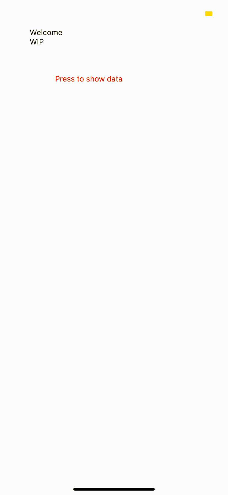

# Jonesdebu COVID-19 REACT native application
## About
This is a mini project to practice working with REACT native and Javascript to display data from a COVID-19 API. It is developed and tested through the expo cli for IOS devices.

## How it works
For learning purposes the app is split into three branches to focus on the individual components.

All Branches can be run by using `npm start` in your terminal.

Note: If the tunnel fails to run start correctly run `npm start --tunnel`

### master
On the master branch is a basic react-native application that displays a google map using react-native-maps.

### COVID-19-API-DATA-DISPLAY
This branch produces a page with a button (TouchableOpacity) that will open an alert with data from the API.

### COVID-19-API-DATA-DISPLAY
This branch also produces a google map, but it uses [fetch](https://reactnative.dev/docs/network) to get the data from the [COVID API](https://covid19api.com/#details) and display the relevant coordinates of the country fetched using a point on the google map. The country to fetch can be found in App.js in the fetch url once you switch your context to this branch.

Note: After getting this functionality working successfully, a week later upon re-opening  and running the application to update the README the application suddenly did not work. Currently the incorrect coordinates are displayed, but the map and point render correctly.

